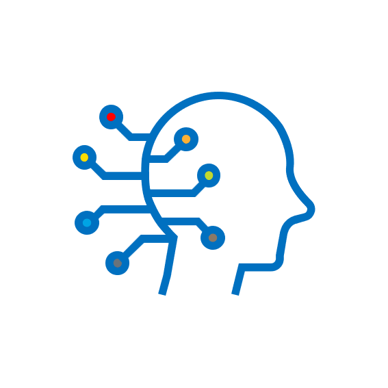

<br />
<div align="left">
  <a href="https://github.com/phdshinai/ANN_DL101">
    
  </a>
</div>

# 신박AI YouTube 예제 코드 페이지

[](LICENSE)
[](https://github.com/phdshinai/ANN_DL101/stargazers)
[](https://github.com/phdshinai/ANN_DL101/network/members)
[](https://github.com/phdshinai/ANN_DL101/issues)

안녕하세요 여러분 신박AI입니다. 여기에 있는 코드들은 제 유튜브 채널 신박AI에서 예제로 사용한 신경망 코드들입니다. 영상을 보시고 또 실습해보시고 싶은 분들을 위하여 업로드하였습니다. 마음껏 사용하셔도 좋습니다. 앞으로 더 많은 (실험적)코드들을 올리도록 하겠습니다.

## Table of Contents

- [Getting Started](#getting-started)
- [License](#license)
- [Contact](#contact)


## Getting Started

1. Clone the repo 리파지토리 클론하기
   ```sh
   git clone https://github.com/phdshinai/ANN_DL101.git
   ```
2. Install dependencies 디펜던시 설치하기
   ```sh
   cd ANN_DL101    
   pip install -r requirements.txt
   ```
## License

This project is licensed under the MIT License - see the [LICENSE](LICENSE) file for details.

## Contact

- Youtube: [신박AI](https://www.youtube.com/@phdshinAI)
- GitHub: [@phdshinai](https://github.com/phdshinai)
- Email: [fusionlab.ai@gmail.com](mailto:fusionlab.ai@gmail.com)

Feel free to reach out if you have any questions or suggestions!

---
